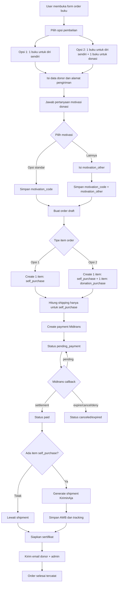

# Plugin Update Plan

Tanggal: 2026-07-10

## Tujuan
Refactor plugin agar mendukung katalog merchandise universal, payment Midtrans-only, shipping via KiriminAja, workflow fulfillment otomatis setelah settlement, dan backup aman sebelum perubahan.

## Ruang Lingkup
1. Backup plugin lama dan siapkan rollback.
2. Ubah domain produk dari khusus boneka kukang menjadi produk/merchandise universal.
3. Hapus atau nonaktifkan semua gateway selain Midtrans.
4. Ganti integrasi shipping dari Biteship ke KiriminAja.
5. Ubah alur order menjadi:
   user order -> pending payment -> settlement Midtrans -> generate AWB KiriminAja -> email admin/user -> sertifikat.
6. Tambahkan migrasi data, pengujian regresi, dan rollout bertahap.
7. Tambahkan order flow khusus buku yang memisahkan pembelian untuk diri sendiri dan pembelian buku yang didonasikan melalui YIARI.
8. Tambahkan pertanyaan motivasi/alasan berdonasi pada form order.

## Detail Plan

### 1. Backup & Rollback
- Backup folder plugin penuh sebelum perubahan.
- Export tabel plugin lama sebelum migrasi.
- Simpan mapping schema lama ke schema baru untuk rollback.

### 2. Refactor Produk Universal
- Ganti istilah domain `doll`, `kukang_dolls`, dan label sejenis menjadi `product`.
- Buat struktur data produk generik:
  `id`, `sku`, `name`, `slug`, `description`, `price_idr`, `price_usd`, `weight_gram`, `length`, `width`, `height`, `is_shippable`, `stock`, `status`, `image`, `sort_order`.
- Tambahkan manager produk di wp-admin:
  pencarian, filter aktif/nonaktif, stok, berat/dimensi, gambar, dan urutan tampil.
- Untuk produk donasi, gunakan model produk + tipe item order, bukan varian yang membingungkan.
  Saran:
  - produk tetap satu, mis. `Buku YIARI`
  - item order menyimpan `fulfillment_type`:
    - `self_purchase`
    - `donation_purchase`
  - ini lebih mudah untuk laporan jumlah buku terjual vs jumlah buku yang didonasikan.

### 3. Payment Midtrans Only
- Audit dan bersihkan semua cabang payment selain Midtrans.
- Rapikan settings admin agar hanya konfigurasi Midtrans yang dipakai.
- Pastikan status internal sinkron dengan status notifikasi Midtrans.

### 4. Shipping KiriminAja
- Ganti seluruh shipping manager yang masih terkait Biteship.
- Integrasikan:
  coverage lookup, pricing, courier preference, create order/AWB, tracking, webhook, dan pickup/drop-off.
- Simpan `shipping_cost`, `courier`, dan `service_type` hasil pricing untuk dipakai saat create order.

### 5. Workflow Fulfillment
- Buat status internal:
  `draft`, `pending_payment`, `paid`, `shipment_requested`, `awb_created`, `shipped`, `delivered`, `canceled`, `returned`.
- Generate resi hanya setelah status Midtrans `settlement`.
- Simpan AWB, link tracking, payload request/response, dan log status pengiriman.
- Order flow buku yang disarankan:
  - Opsi 1: beli 1 buku untuk diri sendiri
    - buat 1 item order `self_purchase`
    - item ini masuk perhitungan shipping
  - Opsi 2: beli 1 buku untuk diri sendiri dan 1 buku untuk didonasikan via YIARI
    - buat 2 item order:
      - 1 item `self_purchase`
      - 1 item `donation_purchase`
    - hanya item `self_purchase` yang masuk perhitungan shipping dan pengiriman
    - item `donation_purchase` tetap masuk subtotal/total dan laporan donasi buku
- Dengan model ini sistem bisa mencatat:
  - jumlah buku yang dibeli donor untuk dirinya sendiri
  - jumlah buku yang dibeli donor untuk didonasikan
  - identitas donor yang terkait dengan donasi buku
  - nilai donasi buku per order dan agregat per periode

### 5A. Data Motivasi Donasi
- Tambahkan 1 pertanyaan pilihan ganda pada form checkout/pemesanan untuk menangkap motivasi/alasan donor berdonasi.
- Tambahkan opsi `Lainnya` yang membuka field teks bebas wajib isi bila dipilih.
- Data ini harus tersimpan di order agar bisa dipakai untuk:
  - analisis motivasi donor
  - segmentasi kampanye
  - reporting internal YIARI
- Saran field:
  - `donation_motivation_code`
  - `donation_motivation_other`
- Contoh kategori pilihan ganda yang bisa dipakai:
  - `ingin_mendukung_misi_yiari`
  - `tertarik_pada_buku_edukasi`
  - `ingin_berdonasi_buku`
  - `rekomendasi_teman_atau_komunitas`
  - `lainnya`

### 6. Email & Sertifikat
- Kirim email ke donor dan admin setelah AWB berhasil dibuat.
- Sertakan nomor resi, link tracking, ringkasan order, dan sertifikat.
- Sertifikat menggunakan template yang sudah ada, sistem hanya mengisi nama donatur dan metadata yang diperlukan.
- Jika order mengandung `donation_purchase`, sertifikat dan email harus menampilkan jumlah buku yang didonasikan secara eksplisit.

### 7. Migrasi Data & Testing
- Siapkan migrasi ke tabel `products`, `orders`, `order_items`, `shipments`, `order_status_logs`, `notifications`, dan `certificate_files` bila diperlukan.
- Lakukan testing untuk:
  form ID/EN, IDR/USD, settlement Midtrans, generate AWB, webhook KiriminAja, email, sertifikat, dan admin export bila masih dipertahankan.
- Tambahkan testing khusus:
  - order hanya `self_purchase`
  - order kombinasi `self_purchase` + `donation_purchase`
  - shipping hanya menghitung item untuk diri sendiri
  - laporan admin memisahkan penjualan buku dan donasi buku
  - field motivasi tersimpan benar untuk opsi standar
  - field `lainnya` wajib bila opsi `lainnya` dipilih

### 8. Rollout
- Implementasi di staging.
- UAT untuk checkout, settlement, AWB, tracking, dan email.
- Rollout ke production setelah backup final dan checklist valid.

## Referensi KiriminAja
- Overview: https://developer.kiriminaja.com/docs/introduction
- Pricing Express: https://developer.kiriminaja.com/docs/pricing/express
- Create Order Express: https://developer.kiriminaja.com/docs/order/express
- Tracking: https://developer.kiriminaja.com/docs/order/tracking
- Register Callback: https://developer.kiriminaja.com/docs/webhook/setup
- Webhook Payload Express: https://developer.kiriminaja.com/docs/webhook/event
- Pickup Schedule: https://developer.kiriminaja.com/docs/pickup/schedule
- Courier List: https://developer.kiriminaja.com/docs/others/courier-list
- Set Courier Preference: https://developer.kiriminaja.com/docs/others/set-preference

## Keputusan Sementara
- Export Excel ke KiriminAja tidak wajib jika integrasi API create AWB berjalan stabil.
- Export manual tetap bisa dipertahankan sebagai fallback operasional/admin, bukan alur utama.
- Untuk flow donasi produk, lebih baik gunakan `fulfillment_type` pada item order daripada membuat varian produk “untuk sendiri” dan “untuk donasi”. Varian akan membuat katalog, stok, dan laporan menjadi lebih rumit tanpa manfaat yang jelas.

## Diagram Flow Order

